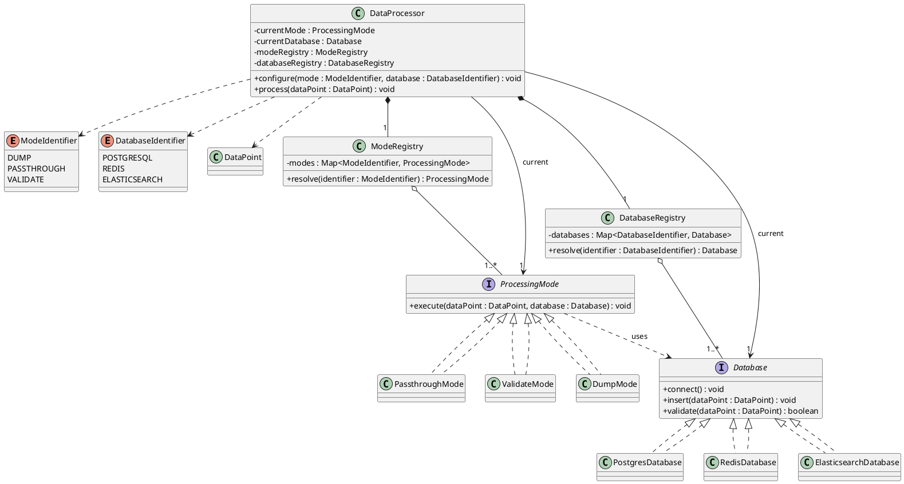

# Architecture: Dynamically Reconfigurable Data Processing Pipeline

## 1. Architecture Analysis

**What varies:** mode behavior (what happens to a `DataPoint`) and database implementation
(how `connect()`/`insert()`/`validate()` are carried out). Both axes are stated to keep
growing.

**What stays stable:** the orchestration contract — `configure(ModeIdentifier,
DatabaseIdentifier)` and `process(DataPoint)` — and the three pre-existing classes
(`DataPoint`, `ModeIdentifier`, `DatabaseIdentifier`).

**Where coupling would occur if unaddressed:** a naive implementation puts a `switch` on
`ModeIdentifier` inside `process()` and a `switch` on `DatabaseIdentifier` inside
`configure()`. Every new mode or database then forces an edit to that central class, and the
processor ends up knowing the internal logic of every mode and every database — a direct
violation of the Open/Closed Principle and a cohesion problem.

**How future extensions are supported:** a new mode or database is added as a new class plus
one registry entry. The orchestrating class and every existing mode/database class are
untouched.

**SOLID principles driving the design:**
- **OCP** — the central requirement; new modes/databases must not require modifying
  existing classes.
- **DIP** — `DataProcessor` depends on the `ProcessingMode` and `Database` abstractions,
  never on `PostgresDatabase`, `RedisDatabase`, etc. directly.
- **SRP** — `DataProcessor` orchestrates only; each mode owns its own logic; each database
  owns its own connection/insert/validate details.
- **ISP** — `Database` (3 methods) and `ProcessingMode` (1 method) stay narrow so no
  implementation is forced to support behavior it doesn't need.
- **LSP** — every mode/database implementation must be a valid drop-in substitute (e.g.
  `DumpMode.execute()` is a legitimate no-op, not a special case the caller must detect).

**Design patterns applied:**
- **Strategy** — for both `ProcessingMode` and `Database`; each defines one interchangeable
  algorithm behind a common interface.
- **Registry** (map-based Factory) — resolves an identifier enum to its Strategy instance via
  `Map.get()`. This is the mechanism that removes `switch`/`if-else` entirely: dispatch
  becomes a lookup, not a branch.
- **Dependency Injection** — registries are built once and handed to `DataProcessor`,
  keeping it unit-testable with mock strategies.

## 2. Architecture Design

- **`Database`** (interface) — `connect()`, `insert(DataPoint)`, `validate(DataPoint):
  boolean`. Implemented by `PostgresDatabase`, `RedisDatabase`, `ElasticsearchDatabase`.
- **`ProcessingMode`** (interface) — `execute(DataPoint, Database)`. Implemented by:
  - `DumpMode` — no-op.
  - `PassthroughMode` — `database.insert(dataPoint)`.
  - `ValidateMode` — `if (database.validate(dataPoint)) database.insert(dataPoint)`.
- **`ModeRegistry`** / **`DatabaseRegistry`** — each wraps a `Map<Identifier, Strategy>`
  populated once at construction; exposes `resolve(identifier)`. This is where
  identifier-to-implementation lookup lives — nowhere else in the system branches on an
  identifier.
- **`DataProcessor`** (Strategy context) — holds the *current* `ProcessingMode` and
  `Database`, plus references to both registries.
  - `configure(mode, db)` resolves both identifiers through the registries and swaps the
    current strategy references, calling `connect()` when the database changes.
  - `process(dataPoint)` delegates to `currentMode.execute(dataPoint, currentDatabase)`.

Adding a fourth mode or database means writing one class and adding one map entry —
`DataProcessor` and all other mode/database classes are never edited.

## 3. UML Class Diagram (textual description)

- `DataPoint`, `ModeIdentifier` «enumeration», `DatabaseIdentifier` «enumeration» — pre-existing,
  unchanged.
- `Database` «interface» is realized by `PostgresDatabase`, `RedisDatabase`,
  `ElasticsearchDatabase` (dashed arrow, hollow triangle).
- `ProcessingMode` «interface» is realized by `DumpMode`, `PassthroughMode`, `ValidateMode`.
- `ProcessingMode` has a dependency on `Database` (it receives one as a parameter, does not
  own it).
- `DatabaseRegistry` aggregates 1..* `Database` instances; `ModeRegistry` aggregates 1..*
  `ProcessingMode` instances (hollow diamond, the registry holds references but the
  strategies exist independently of it).
- `DataProcessor` composes exactly one `ModeRegistry` and one `DatabaseRegistry` (filled
  diamond — they don't outlive the processor) and holds an association to exactly one
  *current* `ProcessingMode` and one *current* `Database`.
- `DataProcessor` depends on `DataPoint` (parameter of `process`) and on both identifier
  enums (parameters of `configure`).

## 4. PlantUML Source

## 5. Engineering Review

| Criterion | Assessment |
|---|---|
| SOLID compliance | Meets SRP, OCP, LSP, ISP, DIP as designed above. |
| Maintainability | Each mode/database is isolated in its own class; changing one cannot break another. |
| Scalability | New modes/databases are additive (new class + registry entry); no existing code is touched. |
| Testability | `DataProcessor` can be unit-tested with mock `ProcessingMode`/`Database`/registries injected via constructor — no static or hidden dependencies. |
| Coupling | `DataProcessor` depends only on the two interfaces and the two registries — never on a concrete database or mode class. |
| Cohesion | High — each class has exactly one reason to change (a mode's logic, a database's connection details, or the orchestration flow). |
| Open/Closed | Satisfied: extension happens by adding classes and registry entries, not by editing `DataProcessor`, `ProcessingMode`, or `Database`. |
| Dependency Inversion | `DataProcessor` depends on abstractions (`ProcessingMode`, `Database`); concrete types are wired in only inside the registries. |
| Simplicity | Two Strategy hierarchies plus two thin registries — no unnecessary layers, no speculative abstractions beyond what the stated growth (more modes, more databases) requires. |

**Weakness identified and resolved during review:** an earlier draft considered a single
`Map<Identifier, Object>` registry shared across modes and databases, "unified" for
DRY's sake. This was rejected — modes and databases are semantically distinct concerns
with different lifecycles (a database needs `connect()` on configuration change; a mode
does not), and merging them would violate SRP for a superficial reduction in class count.
Two small, focused registries are simpler to reason about than one generic one that needs
type-checking at lookup time.

**Remaining limitation:** `configure()` calling `connect()` on every database switch is a
reasonable default, but if databases are expensive to reconnect, a connection-pooling layer
would sit behind `Database` implementations — out of scope for this exercise, and it does
not change the class diagram above.

## 6. Why This Architecture

The design centers on two Strategy hierarchies — `ProcessingMode` and `Database` — because
those are exactly the two axes the problem states will keep growing. Registries replace
conditional dispatch with map lookups, which is what actually removes the `switch`/`if-else`
chains the brief asks to avoid; it isn't a stylistic choice, it's the mechanism. `DataProcessor`
is deliberately thin: it holds current state and delegates, and depends only on interfaces,
so Dependency Inversion is structural rather than incidental.

This satisfies every stated requirement: `configure()` and `process()` exist exactly as
specified; three databases and three modes are implemented against narrow interfaces;
adding a fourth of either requires zero changes to `DataProcessor` or to any other
mode/database class, which is the definition of Open/Closed in practice. The design
resists the temptation to over-engineer — no unnecessary layers, no premature
generalization beyond the two extension points the problem actually calls for, and
composition is used throughout in place of inheritance hierarchies.
