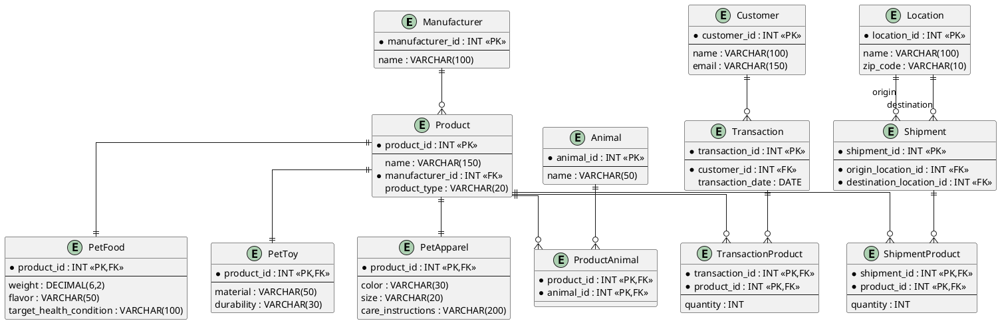

# Pet Department Database Design

## 1. Requirements Analysis

See entity/attribute/key inventory and relationship rationale in the accompanying chat
response. Summary of relationship types:

- **1:N** — `Manufacturer→Product`, `Customer→Transaction`, `Location→Shipment` (×2, as
  origin and destination), `Product→{PetFood|PetToy|PetApparel}` (identifying 1:1
  supertype/subtype link).
- **M:N (via associative entities)** — `Product↔Animal` (`ProductAnimal`),
  `Transaction↔Product` (`TransactionProduct`), `Shipment↔Product` (`ShipmentProduct`).

## 2. Normalization

**1NF:** every attribute is atomic and single-valued. The "collection of products" on a
transaction/shipment is not stored as a repeating group or delimited list — it is
decomposed into one row per product in a junction table.

**2NF:** every table has a key (surrogate or composite) and every non-key attribute depends
on the *whole* key. This matters specifically for the junction tables: in
`TransactionProduct`, `quantity` depends on the combination of `transaction_id` *and*
`product_id` together, not on either alone — a textbook 2NF case.

**3NF:** no non-key attribute depends on another non-key attribute (no transitive
dependencies). `Manufacturer.name` lives only in `Manufacturer`, referenced from `Product`
by `manufacturer_id` — not copied onto every product row. `Location.name`/`zip_code` live
only in `Location`, referenced twice from `Shipment`.

**Supertype/subtype vs. one wide `Product` table:** a single table holding every
attribute (`weight`, `flavor`, `target_health_condition`, `material`, `durability`,
`color`, `size`, `care_instructions`) would force the majority of columns to `NULL` on
every row — a food row has no `size`, a toy row has no `flavor`. That directly violates
the "avoid nullable columns whenever possible" requirement and makes invalid states
representable (nothing stops someone from putting a `flavor` on an apparel row). The
supertype/subtype design keeps `Product` holding only attributes every product genuinely
has, with each category's specific attributes in its own table sharing the `product_id`
primary key — the standard relational pattern for "is-a" hierarchies. This is also the
easiest shape to extend: a fourth product category (e.g. `PetGrooming`) is a new subtype
table, with zero changes to `Product`, `TransactionProduct`, `ShipmentProduct`, or
`ProductAnimal`, since they all reference `product_id` generically.

## 3. Final Relational Schema

**Manufacturer**
| Column | Type | Key |
|---|---|---|
| manufacturer_id | INT | PK |
| name | VARCHAR(100) | |

**Product**
| Column | Type | Key |
|---|---|---|
| product_id | INT | PK |
| name | VARCHAR(150) | |
| manufacturer_id | INT | FK → Manufacturer |
| product_type | VARCHAR(20) | CHECK IN ('FOOD','TOY','APPAREL') |

**PetFood**
| Column | Type | Key |
|---|---|---|
| product_id | INT | PK, FK → Product |
| weight | DECIMAL(6,2) | |
| flavor | VARCHAR(50) | |
| target_health_condition | VARCHAR(100) | |

**PetToy**
| Column | Type | Key |
|---|---|---|
| product_id | INT | PK, FK → Product |
| material | VARCHAR(50) | |
| durability | VARCHAR(30) | |

**PetApparel**
| Column | Type | Key |
|---|---|---|
| product_id | INT | PK, FK → Product |
| color | VARCHAR(30) | |
| size | VARCHAR(20) | |
| care_instructions | VARCHAR(200) | |

**Animal**
| Column | Type | Key |
|---|---|---|
| animal_id | INT | PK |
| name | VARCHAR(50) | UNIQUE |

**ProductAnimal** *(associative entity — resolves Product↔Animal M:N)*
| Column | Type | Key |
|---|---|---|
| product_id | INT | PK, FK → Product |
| animal_id | INT | PK, FK → Animal |

**Customer**
| Column | Type | Key |
|---|---|---|
| customer_id | INT | PK |
| name | VARCHAR(100) | |
| email | VARCHAR(150) | UNIQUE |

**Transaction**
| Column | Type | Key |
|---|---|---|
| transaction_id | INT | PK |
| customer_id | INT | FK → Customer |
| transaction_date | DATE | |

**TransactionProduct** *(associative entity — resolves Transaction↔Product M:N)*
| Column | Type | Key |
|---|---|---|
| transaction_id | INT | PK, FK → Transaction |
| product_id | INT | PK, FK → Product |
| quantity | INT | CHECK (quantity > 0) |

**Location**
| Column | Type | Key |
|---|---|---|
| location_id | INT | PK |
| name | VARCHAR(100) | |
| zip_code | VARCHAR(10) | |

**Shipment**
| Column | Type | Key |
|---|---|---|
| shipment_id | INT | PK |
| origin_location_id | INT | FK → Location |
| destination_location_id | INT | FK → Location |
| CHECK (origin_location_id <> destination_location_id) | | |

**ShipmentProduct** *(associative entity — resolves Shipment↔Product M:N)*
| Column | Type | Key |
|---|---|---|
| shipment_id | INT | PK, FK → Shipment |
| product_id | INT | PK, FK → Product |
| quantity | INT | CHECK (quantity > 0) |

**Cardinalities:** Manufacturer (1) — (0..*) Product · Product (1) — (1) subtype table ·
Product (1..*) — (1..*) Animal via ProductAnimal · Customer (1) — (0..*) Transaction ·
Transaction (1..*) — (1..*) Product via TransactionProduct · Location (1) — (0..*)
Shipment as origin · Location (1) — (0..*) Shipment as destination · Shipment (1..*) —
(1..*) Product via ShipmentProduct.

## 4. PlantUML ERD Source

## 5. Database Architecture Review

| Criterion | Assessment |
|---|---|
| Normalization | 3NF throughout; no repeating groups, no transitive dependencies, no update/insert/delete anomalies — manufacturer and location data each live in exactly one place. |
| Scalability | Junction tables with composite PKs scale linearly with transaction/shipment volume; no wide tables that grow by column. |
| Maintainability | Adding an attribute to one product category touches only that subtype table. |
| Extensibility | A new product category = one new subtype table; a new relationship (e.g. supplier returns) = one new junction table. Neither requires touching existing tables. |
| Referential integrity | Every FK is enforced (`Product.manufacturer_id`, subtype PK/FKs, both `Shipment` location FKs, all junction table FKs). |
| Naming consistency | Singular table names, `_id` suffix for all surrogate keys, junction tables named `<EntityA><EntityB>`. |
| Redundancy | None found — manufacturer name, location name/zip, and animal name each stored exactly once. |
| Unnecessary tables | None added beyond what the M:N relationships and the nullable-column problem require. |

**Design decision challenged during review:** an initial pass considered a single
`ShippingRecord` table with a `direction` flag instead of two FK columns
(`origin_location_id`, `destination_location_id`) on `Shipment`. Rejected — a flag-based
design still needs the *other* location stored somewhere, re-deriving the same two-FK
shape with extra indirection. Two explicit FKs to `Location`, enforced with a `CHECK
(origin_location_id <> destination_location_id)`, is simpler and self-documenting.

**Missing relationship considered and deliberately excluded:** a `Store` (selling
location) distinct from `Location` (shipment endpoint) was considered, since the brief
separately mentions "Store: customer name, email" and "Locations." Re-reading the
requirements, "Store" here reads as the verb ("the system stores customer name and
email"), not a `Store` entity — so no `Store` table was introduced. If Walmart's actual
requirement is that transactions occur at a specific store location, `Transaction` would
gain a `location_id` FK; this is flagged as an open question rather than guessed at.

**No unnecessary tables were introduced beyond the three associative entities the M:N
relationships require**, and no correctness was sacrificed to reduce table count further.

## 6. Why This Schema

The design separates three concerns that the requirements keep distinct: **what a product
is** (supertype/subtype, so category-specific attributes never produce null columns
elsewhere), **who buys what** (`Customer`→`Transaction`→`TransactionProduct`→`Product`),
and **how products move between locations** (`Location`→`Shipment`→`ShipmentProduct`→
`Product`). All three many-to-many relationships in the requirements — product-to-animal,
transaction-to-product, shipment-to-product — are resolved with associative entities
carrying exactly the attributes those relationships need (`quantity` where a real count
applies, nothing where it doesn't), which is what keeps the schema in 3NF without
inventing structure the requirements didn't ask for.

Cardinalities follow directly from the business rules as stated: a product belongs to
exactly one manufacturer but many-to-many with animals; a transaction belongs to one
customer but many-to-many with products; a shipment has exactly one origin and one
destination location but many-to-many with products. Junction tables were used
specifically because plain foreign keys cannot represent many-to-many relationships in a
relational model — this is not a stylistic choice but a structural requirement.

Future growth is accommodated without redesign: a new product category is a new subtype
table referencing `Product.product_id`; a new relationship (e.g. product reviews, supplier
returns, in-store pickup locations) is a new table with its own FKs, added independently
of everything else. Nothing in the existing schema needs to change shape to support either
kind of growth, which is the practical definition of an extensible design.
